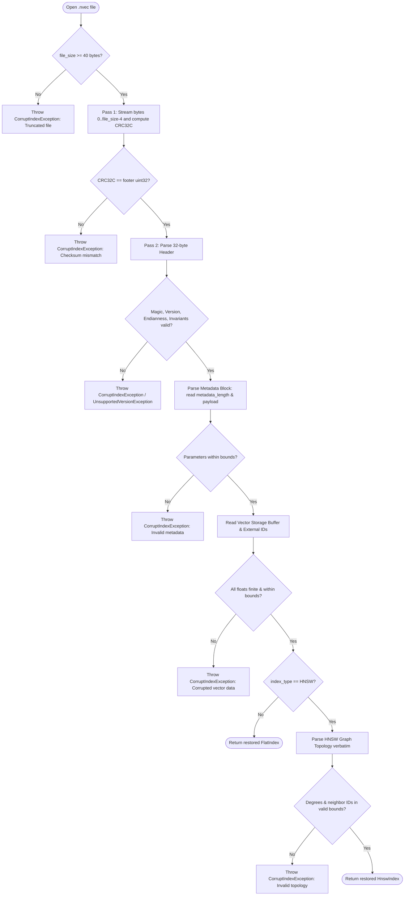

# NanoVector Binary Format Specification (NVEC v1)

**Version:** 1.0.0  
**Status:** Approved / Active  
**Default File Extension:** `.nvec`  
**Standard Endianness:** Little-Endian (Explicit Format Choice)

---

## 1. Overview and Design Principles

The `NVEC` binary format defines a self-contained, portable binary storage format for vector indexes created by the NanoVector engine (`FlatIndex` and `HnswIndex`).

### Core Design Goals
1. **Explicit Endianness:** NVEC v1 uses Little-Endian encoding as an explicit format choice to guarantee cross-platform binary reproducibility across diverse CPU architectures.
2. **Fixed 32-Byte Header:** Enables $O(1)$ header inspection, version validation, and capability checks prior to streaming or allocating buffer memory.
3. **Self-Delimited Metadata Block:** Prefixed with a 4-byte `metadata_length` field. Parsers read known parameters and safely skip forward over unknown extension bytes, guaranteeing forward compatibility for minor revisions.
4. **Contiguous Primitive Serialization:** Vector data is laid out sequentially as raw IEEE 754 single-precision floats (`float32`), directly mirroring the internal contiguous buffer of `VectorStorage` for potential memory-mapping (`MMap`) or direct bulk buffer transfers.
5. **Exact Graph Topology Reconstruction:** For HNSW indexes, the multi-layer graph topology is serialized verbatim. Restoration is an $O(E)$ direct structural reconstruction without re-running distance computations, neighbor heuristic selection, or pruning.
6. **Hardware-Accelerated Corruption Detection:** A 4-byte CRC32C checksum (Castagnoli polynomial $0x82F63B78$) protects the file payload against bit flips or truncation, utilizing CPU instructions (SSE4.2 `CRC32` on x86, ARMv8 CRC on aarch64) exposed through standard `java.util.zip.CRC32C`.

---

## 2. File Structure

An `.nvec` file consists of 5 or 6 sequential blocks:

```
+=============================================================================+
| 1. Fixed File Header (32 bytes)                                             |
|    - Magic bytes ("NVEC")                                                   |
|    - Format version (1)                                                     |
|    - Endianness marker (1 = Little-Endian)                                  |
|    - Index type (1 = FLAT, 2 = HNSW)                                        |
|    - Metric code (1 = EUCLIDEAN, 2 = COSINE, 3 = DOT_PRODUCT)               |
|    - Reserved bytes (3 bytes zero)                                          |
|    - Dimension D (int32)                                                    |
|    - Vector count N (int32)                                                 |
|    - Header padding (12 bytes zero)                                         |
+-----------------------------------------------------------------------------+
| 2. Metadata Block (Variable length)                                         |
|    - metadata_length (4 bytes int32)                                        |
|    - Payload:                                                               |
|        * FLAT: 0 bytes (metadata_length = 0)                                |
|        * HNSW: 24 bytes (M, M0, efConstruction, efSearch, maxLevel, epId)   |
+-----------------------------------------------------------------------------+
| 3. Vector Storage Block                                                     |
|    - N * D * 4 bytes (IEEE 754 float32, contiguous row-major)                |
+-----------------------------------------------------------------------------+
| 4. External ID Mapping Block                                                |
|    - N * 8 bytes (int64 external IDs, ordered by internalId 0..N-1)         |
+-----------------------------------------------------------------------------+
| 5. Graph Topology Block (HNSW only)                                         |
|    - For each internal node 0..N-1:                                         |
|        * node_max_level (1 byte uint8)                                      |
|        * For layer l = 0..node_max_level:                                   |
|            - neighbor_count (2 bytes uint16)                                |
|            - neighbor_ids (neighbor_count * 4 bytes int32)                  |
+-----------------------------------------------------------------------------+
| 6. Checksum Footer (4 bytes)                                                |
|    - CRC32C of all bytes in range [0, file_size - 4)                        |
+=============================================================================+
```

---

## 3. Block Specifications

### 3.1 Fixed File Header (32 bytes)

| Offset | Field Name | Data Type | Value / Constraints | Description |
|---|---|---|---|---|
| `0x00 - 0x03` | `magic` | 4 bytes ASCII | `0x4E 0x56 0x45 0x43` ("NVEC") | Magic identification signature |
| `0x04 - 0x05` | `version` | uint16 LE | `1` | Format major version |
| `0x06` | `endianness` | uint8 | `1` (`0x01` = Little-Endian) | Explicit endianness indicator |
| `0x07` | `index_type` | uint8 | `1` = FLAT, `2` = HNSW | Target index architecture |
| `0x08` | `metric` | uint8 | `1` = EUCLIDEAN, `2` = COSINE, `3` = DOT_PRODUCT | Similarity distance metric |
| `0x09 - 0x0B` | `reserved` | 3 bytes | `0x00 0x00 0x00` | Reserved for alignment; must be 0 |
| `0x0C - 0x0F` | `dimension` | int32 LE | $D > 0$ | Vector dimensionality |
| `0x10 - 0x13` | `vector_count`| int32 LE | $N \ge 0$ | Number of active vectors in storage |
| `0x14 - 0x1F` | `header_padding`| 12 bytes | `0x00 * 12` | Zero-padding to align header to 32 bytes |

**Header Invariant Rules:**
- If `magic != [0x4E, 0x56, 0x45, 0x43]`, abort with `CorruptIndexException`.
- If `version != 1`, abort with `UnsupportedVersionException`.
- If `endianness != 1`, abort with `CorruptIndexException` (Big-Endian is not supported in v1).
- If `index_type` is not in `{1, 2}`, abort with `CorruptIndexException`.
- If `metric` is not in `{1, 2, 3}`, abort with `CorruptIndexException`.
- If any byte of `reserved` or `header_padding` is non-zero, abort with `CorruptIndexException`.
- If `dimension <= 0` or `vector_count < 0`, abort with `CorruptIndexException`.

---

### 3.2 Metadata Block

The metadata block begins immediately at offset `0x20` (32 bytes).

| Offset | Field Name | Data Type | Value / Constraints | Description |
|---|---|---|---|---|
| `0x20 - 0x23` | `metadata_length` | int32 LE | $\ge 0$ | Length of the metadata payload in bytes |

#### 3.2.1 FLAT Metadata Payload (`index_type == 1`)
- `metadata_length` = `0`.
- Payload size: 0 bytes.
- The vector storage block begins immediately at offset `0x24` (36 bytes).

#### 3.2.2 HNSW Metadata Payload (`index_type == 2`)
- In v1, `metadata_length` = `24`.
- Payload layout:

| Relative Offset | Field Name | Data Type | Constraints | Description |
|---|---|---|---|---|
| `+0x00` (`0x24`) | `m` | int32 LE | $M \ge 2$ | Maximum outgoing edges per node at layers $> 0$ |
| `+0x04` (`0x28`) | `m0` | int32 LE | $M_0 \ge M$ | Maximum outgoing edges per node at layer 0 |
| `+0x08` (`0x2C`) | `ef_construction` | int32 LE | $> 0$ | Size of dynamic candidate list during build |
| `+0x0C` (`0x30`) | `default_ef_search` | int32 LE | $> 0$ | Default search candidate list size |
| `+0x10` (`0x34`) | `max_level` | int32 LE | $-1$ if $N=0$; $\ge 0$ if $N>0$ | Highest active layer in the HNSW graph |
| `+0x14` (`0x38`) | `entry_point_id` | int32 LE | $-1$ if $N=0$; $0 \le id < N$ if $N>0$ | Internal ID of entry point node |

**Forward Compatibility Rule:**
If a future version or extension writes `metadata_length > 24` (for HNSW) or `metadata_length > 0` (for FLAT), a v1 parser reads the known fields and skips forward by `metadata_length - known_bytes` bytes before parsing the Vector Storage Block.

---

### 3.3 Vector Storage Block

The vector storage block immediately follows the metadata block.
- Total byte size: $N \times D \times 4$ bytes.
- Format: Flat sequence of IEEE 754 32-bit floats (`float32` Little-Endian).
- Memory layout: Row-major contiguous buffer where vector $i \in [0, N-1]$ occupies float indices $[i \times D, (i+1) \times D - 1]$.

**Invariants:**
- Every float value must be finite (`!Float.isNaN(v) && !Float.isInfinite(v)`).
- If `metric == COSINE`, every stored vector must have unit norm ($\|v\|_2 \approx 1.0$).
- When $N = 0$, this block is 0 bytes.

---

### 3.4 External ID Mapping Block

Immediately follows the Vector Storage Block.
- Total byte size: $N \times 8$ bytes.
- Format: Flat sequence of signed 64-bit integers (`int64` Little-Endian).
- Semantics: Entry at position $i$ represents the external `long` ID corresponding to `internalId` $i$.
- When $N = 0$, this block is 0 bytes.

---

### 3.5 Graph Topology Block (HNSW Only)

Present **only** when `index_type == 2` (HNSW). When $N = 0$, this block is 0 bytes.
For each internal node $i \in [0, N-1]$ (in strictly ascending order of internal ID $0, 1, \dots, N-1$):

1. **`node_max_level`** (1 byte, uint8):
   - Highest layer this node participates in ($0 \le \text{node\_max\_level} \le \text{max\_level}$).
2. **Layer Adjacency Lists** for each layer $l$ from $0$ up to `node_max_level` inclusive:
   - **`neighbor_count`** (2 bytes, uint16 LE):
     - Layer 0: $0 \le \text{neighbor\_count} \le M_0$.
     - Layer $l > 0$: $0 \le \text{neighbor\_count} \le M$.
   - **`neighbor_ids`** ($\text{neighbor\_count} \times 4$ bytes, int32 LE):
     - Each neighbor ID must be a valid internal node: $0 \le \text{neighbor\_id} < N$.
     - Self-loops are prohibited ($\text{neighbor\_id} \ne i$).
     - No duplicate neighbor IDs may occur within the same layer.

---

### 3.6 Checksum Footer (4 bytes)

- Position: Final 4 bytes of the file ($[\text{file\_size} - 4, \text{file\_size})$).
- Type: uint32 Little-Endian.
- Algorithm: CRC32C (Castagnoli polynomial $0x82F63B78$, reflection in/out, initial value $0xFFFFFFFF$, XOR out $0xFFFFFFFF$).
- Coverage: Calculated over all preceding file bytes $[0, \text{file\_size} - 4)$.
- Implementation note: Standard Java SE 9+ provides `java.util.zip.CRC32C`, which compiles directly to native hardware instructions (`_mm_crc32_u64` on x86-64 SSE4.2; `__crc32cw` on ARMv8).

---

## 4. Exact File Size Formulas

### 4.1 Flat Index File Size
For a `FlatIndex` with $N$ vectors and dimension $D$:

$$\text{FileSize}_{\text{FLAT}} = 32 + 4 + (N \times D \times 4) + (N \times 8) + 4 = 40 + N \times (4D + 8) \text{ bytes}$$

*Examples:*
- $N = 0$: $40$ bytes.
- $N = 10{,}000$, $D = 128$: $40 + 10{,}000 \times (512 + 8) = 5{,}200{,}040$ bytes ($\approx 4.96$ MB).

### 4.2 HNSW Index File Size
For an `HnswIndex` with $N$ vectors, dimension $D$, and graph topology:

$$\text{FileSize}_{\text{HNSW}} = 32 + 4 + 24 + (N \times D \times 4) + (N \times 8) + \text{TopologySize} + 4$$

$$\text{FileSize}_{\text{HNSW}} = 64 + N \times (4D + 8) + \sum_{i=0}^{N-1} \left( 1 + \sum_{l=0}^{\text{level}_i} (2 + 4 \times \text{degree}_{i, l}) \right) \text{ bytes}$$

---

## 5. Verification and Reading Protocol

A conforming `.nvec` reader **must** follow a strict two-pass validation protocol:



### Robustness & Corruption Constraints:
1. **Never allocate memory based on untrusted size fields** before verifying CRC32C.
2. **Never allow out-of-bounds node references**: Any neighbor ID $\ge N$ or $< 0$ indicates corruption and must be rejected before instantiating graph objects.
3. **No self-loops**: Nodes must not contain edges to themselves.
4. **Header zero-checks**: All reserved bytes and header padding bytes must be strictly $0x00$. Non-zero bytes indicate either unknown incompatible extensions or file corruption.

---

## 6. Error Conditions and Exceptions

| Failure Mode | Detection Phase | Exception Thrown |
|---|---|---|
| File smaller than 40 bytes (minimum valid file) | Pass 1 | `CorruptIndexException` |
| CRC32C does not match footer | Pass 1 | `CorruptIndexException` |
| Magic bytes are not `"NVEC"` | Pass 2 (Header) | `CorruptIndexException` |
| Version is not `1` | Pass 2 (Header) | `UnsupportedVersionException` |
| Endianness is not `1` | Pass 2 (Header) | `CorruptIndexException` |
| Unknown index type or distance metric code | Pass 2 (Header) | `CorruptIndexException` |
| Non-zero reserved or padding bytes | Pass 2 (Header) | `CorruptIndexException` |
| Dimension $\le 0$ or Vector count $< 0$ | Pass 2 (Header) | `CorruptIndexException` |
| File size does not match expected length | Pass 2 (Payload) | `CorruptIndexException` |
| Vector contains `NaN` or `Infinity` | Pass 2 (Vectors) | `CorruptIndexException` |
| Neighbor ID $\ge N$ or $< 0$ or self-loop | Pass 2 (Topology) | `CorruptIndexException` |
| Layer degree exceeds $M_0$ (layer 0) or $M$ (layer $> 0$) | Pass 2 (Topology) | `CorruptIndexException` |
